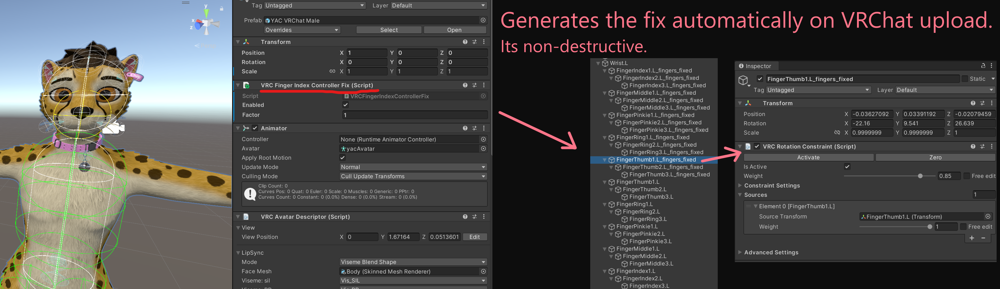
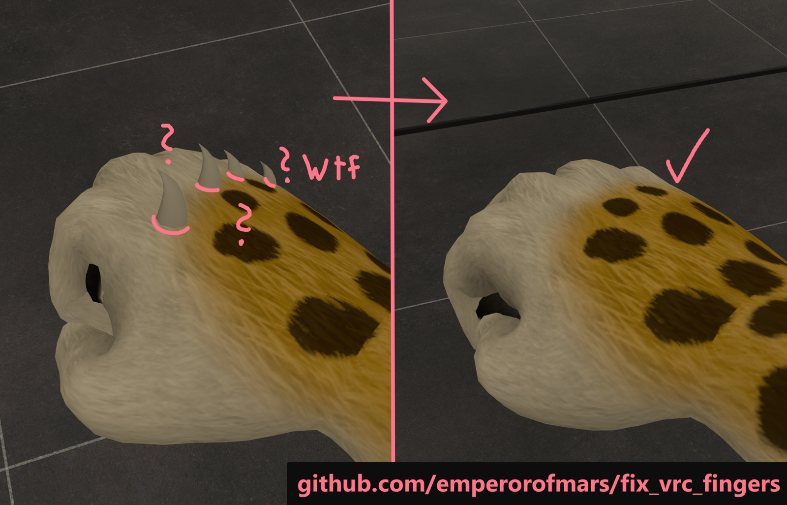

# Workaround for VRChat ignoring Unity muscle-settings for finger bones when using Valve Index controllers.

VRChat Bug: https://feedback.vrchat.com/avatar-30/p/finger-muscle-settings

This is a stupid utility which automatically generates a workaround for this bug.

**Use this only, if the in-game `Legacy Fingers` option doesn't yield good-enough results!**

The moment VRChat fixes that bug, this tool will become obsolete and should not be used.

## Usage
* Add the **[Squirrelbite repository](https://squirrelbite.github.io/vpm/)** to the VRChat Creator Companion.
* Install the `Fix VRC Fingers` package in your avatar-project.
* Add the `VRCFingerIndexControllerFix` Component to your avatar's root GameObject.
* Optionally tweak the `Factor` value.
* Upload to VRChat!

Note, this will add 30 VRC Rotation Constraints to your avatar, and may negatively impact your avatar's performance rating.

Alternatively, you can also apply the fix manually.\
To do so, open the utility under `Tools` → `Fix VRC Fingers (For Valve Index Controllers)`.\
Drag the avatar's root GameObject in, optionally tweak the `Factor` value, and hit the `Fix` button.

## How It Works
It generates a 'shadow-rig' for the finger bones, which will be mapped in the Unity-Avatar.\
The actual bones to which your model is weight-painted to, will be renamed.\
The renamed bones will be constrained to the corresponding 'shadow-bones'.

The strength of these constraints will be determined from the humanoid muscle-limits.\
The strength calculation is based on a visual estimate and will not be perfect, but hopefully good enough to prevent glitching.

## Limitations
* Finger spread is not accounted for. It will be constrained by the same factor as the stretch.
* It doesn't account for the center point, neither does VRC in-game with Index controllers.
*Note: The center point seems to be made up by Unity and is not based on your rig's default pose. You can't tweak the center point anyway in the Unity Editor, it is only possible with C#. (afaik)*

---

Cheers!
